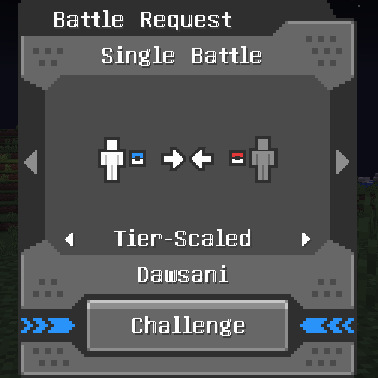

# Cobblemon: Tier-Scaled Battles
This is an addon mod for Cobblemon that adds a new "Tier-Scaled" option to the PvP battle level options. In a Tier-Scaled battle, each Pokemon's level is set based on it's competative tier on Pokemon Showdown. Generally, weaker Pokemon will be higher level while stronger Pokemon will be lower level. This allows for a much more diverse pool of battle-viable Pokemon

# Tiering Information
Each Pokemon's tier is based on the tier provided by Pokemon Showdown in the National Dex format. Each Pokemon's level in a tier-scaled battle directly corresponds to their tier. Below is a list of each tier and it's corresponding level. The level assigned to each pokemon in a tier is based on Pokemon Showdown's assignment as well. 

| Tier | Level |
| ---- | ----- |
| AG (Anything Goes) | 71 |
| Uber | 73 |
| OU (Over-Used) | 75 |
| UU (Under-Used) | 77 |
| UUBL (Under-Used Ban List) | 76 |
| RU (Rarely Used) | 79 |
| RUBL (Rarely Used Ban List) | 76 |
| NFE (Not Fully Evolved) | 84 |

## Forms
Some species of Pokemon have different tiers for different forms. For example, normal Lucario is RU, while Mega Lucario is Uber. The mod determines if a Pokemon will be tiered by it's Mega form based on whether or not it is holding a Mega Stone (Any Mega Stone for now). And for Pokemon with multiple Mega Evolutions, it determines which Mega form to tier it by based on the type of Mega Stone the Pokemon is holding (X, Y or Z Mega Stones). So to complete the Lucario example:
- Lucario holding no Mega Stone will be RU tier and level 79.
- Lucario holding the Lucarionite will be Uber tier and level 73.
- Lucario holding the Lucarionite Z will be OU tier and level 75.

> [!NOTE]
> All Mega Evolution forms from Pokemon Legends: Z-A are tiered at OU for now.

# Commands
There is currently only one command included with this mod: `/checktier <pokemon name>`

This command shows you the tier and adjusted level of the specified Pokemon. If you want to check a specific form of a Pokemon, generally you can add the form to the end of the Pokemon's name. For example to check Lucario and it's various forms you would use the following commands:

| Lucario Form | Command                   |
| ------------ |---------------------------|
| Normal | `/checktier lucario`      |
| Mega   | `/checktier lucariomega`  |
| Mega Z | `/checktier lucariomegaz` |

# Bugs
Cobblemon and Pokemon alike have over 1,000 different species, many with different forms that sometimes have different tiers. This mod has not been tested with each and every one of those species. It is not unlikely that you may encounter a Pokemon being set to level 1 in a tier-scaled battle. This is becuase level 1 is the default level if no tier is found for the species or if no level has been assigned to it's tier.

Please report any bugs you find to me over GitHub, Modrinth, CurseForge or email at [dawson@dawsonmatthews.com](mailto:dawson@dawsonmatthews.com).

# Compatability
For the Mega Forms, this mod was only made in mind with the Mega Showdown mod and Navas ZA Mega. If you want this mod to work with other Mega evolution mods let me know and I'll get back to you.

# All Species Tiers and Levels
| Species | Tier | Level |
| - | - | - |
| bulbasaur |  | 1 |
| ivysaur |  | 1 |
| venusaur | RU | 79 |
| venusaurmega | UU | 77 |
| venusaurgmax |  | 1 |
| charmander |  | 1 |
| charmeleon |  | 1 |
| charizard | RU | 79 |
| charizardmegax | UUBL | 76 |
| charizardmegay | OU | 75 |
| charizardgmax |  | 1 |
| squirtle |  | 1 |
| wartortle |  | 1 |
| blastoise | RU | 79 |
| blastoisemega | Uber | 73 |
| blastoisegmax |  | 1 |
| caterpie | LC | 1 |
| metapod | NFE | 84 |
| butterfree | RU | 79 |
| butterfreegmax |  | 1 |
| weedle | LC | 1 |
| kakuna | NFE | 84 |
| beedrill | RU | 79 |
| beedrillmega | UU | 77 |
| pidgey | LC | 1 |
| pidgeotto | NFE | 84 |
| pidgeot | RU | 79 |
| pidgeotmega | RU | 79 |
| rattata | LC | 1 |
| rattataalola | LC | 1 |
| raticate | RU | 79 |
| raticatealola | RU | 79 |
| raticatealolatotem |  | 1 |
| spearow | LC | 1 |
| fearow | RU | 79 |
| ekans |  | 1 |
| arbok | RU | 79 |
| pichu |  | 1 |
| pichuspikyeared |  | 1 |
| pikachu | RU | 79 |
| pikachucosplay |  | 1 |
| pikachurockstar |  | 1 |
| pikachubelle |  | 1 |
| pikachupopstar |  | 1 |
| pikachuphd |  | 1 |
| pikachulibre |  | 1 |
| pikachuoriginal | RU | 79 |
| pikachuhoenn | RU | 79 |
| pikachusinnoh | RU | 79 |
| pikachuunova | RU | 79 |
| pikachukalos | RU | 79 |
| pikachualola | RU | 79 |
| pikachupartner | RU | 79 |
| pikachustarter |  | 1 |
| pikachugmax |  | 1 |
| pikachuworld | RU | 79 |
| raichu | RU | 79 |
| raichualola | RU | 79 |
| sandshrew |  | 1 |
| sandshrewalola |  | 1 |
| sandslash | RU | 79 |
| sandslashalola | RU | 79 |
| nidoranf | LC | 1 |
| nidorina | NFE | 84 |
| nidoqueen | RU | 79 |
| nidoranm | LC | 1 |
| nidorino | NFE | 84 |
| nidoking | RU | 79 |
| cleffa |  | 1 |
| clefairy | NFE | 84 |
| clefable | UU | 77 |
| vulpix | LC | 1 |
| vulpixalola |  | 1 |
| ninetales | RU | 79 |
| ninetalesalola | RU | 79 |
| igglybuff |  | 1 |
| jigglypuff |  | 1 |
| wigglytuff | RU | 79 |
| zubat | LC | 1 |
| golbat | NFE | 84 |
| crobat | RU | 79 |
| oddish |  | 1 |
| gloom |  | 1 |
| vileplume | RU | 79 |
| bellossom | RU | 79 |
| paras | LC | 1 |
| parasect | RU | 79 |
| venonat |  | 1 |
| venomoth | RU | 79 |
| diglett |  | 1 |
| diglettalola |  | 1 |
| dugtrio | RU | 79 |
| dugtrioalola | RU | 79 |
| meowth |  | 1 |
| meowthalola |  | 1 |
| meowthgalar |  | 1 |
| meowthgmax |  | 1 |
| persian | RU | 79 |
| persianalola | RU | 79 |
| perrserker | RU | 79 |
| psyduck |  | 1 |
| golduck | RU | 79 |
| mankey |  | 1 |
| primeape | NFE | 84 |
| growlithe |  | 1 |
| growlithehisui |  | 1 |
| arcanine | RU | 79 |
| arcaninehisui | RU | 79 |
| poliwag |  | 1 |
| poliwhirl |  | 1 |
| poliwrath | RU | 79 |
| politoed | RU | 79 |
| abra | LC | 1 |
| kadabra | NFE | 84 |
| alakazam | RUBL | 78 |
| alakazammega | Uber | 73 |
| machop | LC | 1 |
| machoke | NFE | 84 |
| machamp | RU | 79 |
| machampgmax |  | 1 |
| bellsprout |  | 1 |
| weepinbell |  | 1 |
| victreebel | RU | 79 |
| tentacool |  | 1 |
| tentacruel | RU | 79 |
| geodude |  | 1 |
| geodudealola |  | 1 |
| graveler |  | 1 |
| graveleralola |  | 1 |
| golem | RU | 79 |
| golemalola | RU | 79 |
| ponyta | LC | 1 |
| ponytagalar | LC | 1 |
| rapidash | RU | 79 |
| rapidashgalar | RU | 79 |
| slowpoke |  | 1 |
| slowpokegalar |  | 1 |
| slowbro | UU | 77 |
| slowbromega | UU | 77 |
| slowbrogalar | UU | 77 |
| slowking | RU | 79 |
| slowkinggalar | OU | 75 |
| magnemite |  | 1 |
| magneton | NFE | 84 |
| magnezone | UU | 77 |
| farfetchd | RU | 79 |
| farfetchdgalar | LC | 1 |
| sirfetchd | RU | 79 |
| doduo |  | 1 |
| dodrio | RU | 79 |
| seel |  | 1 |
| dewgong | RU | 79 |
| grimer |  | 1 |
| grimeralola |  | 1 |
| muk | RU | 79 |
| mukalola | RU | 79 |
| shellder |  | 1 |
| cloyster | RU | 79 |
| gastly |  | 1 |
| haunter |  | 1 |
| gengar | RUBL | 78 |
| gengarmega | AG | 71 |
| gengargmax |  | 1 |
| onix | LC | 1 |
| steelix | RU | 79 |
| steelixmega | RU | 79 |
| drowzee |  | 1 |
| hypno | RU | 79 |
| krabby | LC | 1 |
| kingler | RU | 79 |
| kinglergmax |  | 1 |
| voltorb |  | 1 |
| voltorbhisui | LC | 1 |
| electrode | RU | 79 |
| electrodehisui | RU | 79 |
| exeggcute |  | 1 |
| exeggutor | RU | 79 |
| exeggutoralola | RU | 79 |
| cubone | LC | 1 |
| marowak | RU | 79 |
| marowakalola | RU | 79 |
| marowakalolatotem |  | 1 |
| tyrogue |  | 1 |
| hitmonlee | RU | 79 |
| hitmonchan | RU | 79 |
| hitmontop | RU | 79 |
| lickitung | LC | 1 |
| lickilicky | RU | 79 |
| koffing |  | 1 |
| weezing | RU | 79 |
| weezinggalar | RU | 79 |
| rhyhorn |  | 1 |
| rhydon | NFE | 84 |
| rhyperior | RU | 79 |
| happiny |  | 1 |
| chansey | UU | 77 |
| blissey | UU | 77 |
| tangela | NFE | 84 |
| tangrowth | RU | 79 |
| kangaskhan | RU | 79 |
| kangaskhanmega | Uber | 73 |
| horsea |  | 1 |
| seadra |  | 1 |
| kingdra | RU | 79 |
| goldeen | LC | 1 |
| seaking | RU | 79 |
| staryu | LC | 1 |
| starmie | RU | 79 |
| mimejr | LC | 1 |
| mrmime | RU | 79 |
| mrmimegalar | NFE | 84 |
| mrrime | RU | 79 |
| scyther | NFE | 84 |
| scizor | UU | 77 |
| scizormega | OU | 75 |
| kleavor | RU | 79 |
| smoochum | LC | 1 |
| jynx | RU | 79 |
| elekid |  | 1 |
| electabuzz |  | 1 |
| electivire | RU | 79 |
| magby |  | 1 |
| magmar |  | 1 |
| magmortar | RU | 79 |
| pinsir | RU | 79 |
| pinsirmega | UUBL | 76 |
| tauros | RU | 79 |
| taurospaldeacombat | RU | 79 |
| taurospaldeablaze | RU | 79 |
| taurospaldeaaqua | RU | 79 |
| magikarp |  | 1 |
| gyarados | UUBL | 76 |
| gyaradosmega | UUBL | 76 |
| lapras | RU | 79 |
| laprasgmax |  | 1 |
| ditto | RU | 79 |
| eevee |  | 1 |
| eeveestarter |  | 1 |
| eeveegmax |  | 1 |
| vaporeon | RU | 79 |
| jolteon | RU | 79 |
| flareon | RU | 79 |
| espeon | RU | 79 |
| umbreon | RU | 79 |
| leafeon | RU | 79 |
| glaceon | RU | 79 |
| sylveon | RU | 79 |
| porygon |  | 1 |
| porygon2 | NFE | 84 |
| porygonz | UU | 77 |
| omanyte | LC | 1 |
| omastar | RU | 79 |
| kabuto | LC | 1 |
| kabutops | RU | 79 |
| aerodactyl | RU | 79 |
| aerodactylmega | UU | 77 |
| munchlax |  | 1 |
| snorlax | RU | 79 |
| snorlaxgmax |  | 1 |
| articuno | RU | 79 |
| articunogalar | RU | 79 |
| zapdos | OU | 75 |
| zapdosgalar | UUBL | 76 |
| moltres | OU | 75 |
| moltresgalar | UU | 77 |
| dratini |  | 1 |
| dragonair |  | 1 |
| dragonite | OU | 75 |
| mewtwo | Uber | 73 |
| mewtwomegax | Uber | 73 |
| mewtwomegay | Uber | 73 |
| mew | UU | 77 |
| chikorita |  | 1 |
| bayleef |  | 1 |
| meganium | RU | 79 |
| cyndaquil |  | 1 |
| quilava |  | 1 |
| typhlosion | RU | 79 |
| typhlosionhisui | RU | 79 |
| totodile |  | 1 |
| croconaw |  | 1 |
| feraligatr | RU | 79 |
| sentret |  | 1 |
| furret | RU | 79 |
| hoothoot |  | 1 |
| noctowl | RU | 79 |
| ledyba | LC | 1 |
| ledian | RU | 79 |
| spinarak |  | 1 |
| ariados | RU | 79 |
| chinchou |  | 1 |
| lanturn | RU | 79 |
| togepi | LC | 1 |
| togetic | NFE | 84 |
| togekiss | RU | 79 |
| natu | LC | 1 |
| xatu | RU | 79 |
| mareep |  | 1 |
| flaaffy |  | 1 |
| ampharos | RU | 79 |
| ampharosmega | RU | 79 |
| azurill |  | 1 |
| marill |  | 1 |
| azumarill | RUBL | 78 |
| bonsly |  | 1 |
| sudowoodo | RU | 79 |
| hoppip |  | 1 |
| skiploom |  | 1 |
| jumpluff | RU | 79 |
| aipom |  | 1 |
| ambipom | RU | 79 |
| sunkern |  | 1 |
| sunflora | RU | 79 |
| yanma |  | 1 |
| yanmega | RU | 79 |
| wooper |  | 1 |
| wooperpaldea |  | 1 |
| quagsire | RU | 79 |
| murkrow |  | 1 |
| honchkrow | RU | 79 |
| misdreavus |  | 1 |
| mismagius | RU | 79 |
| unown | RU | 79 |
| wynaut | LC | 1 |
| wobbuffet | RU | 79 |
| girafarig |  | 1 |
| farigiraf | RU | 79 |
| pineco |  | 1 |
| forretress | RU | 79 |
| dunsparce |  | 1 |
| dudunsparce | RU | 79 |
| gligar | NFE | 84 |
| gliscor | OU | 75 |
| snubbull |  | 1 |
| granbull | RU | 79 |
| qwilfish | RU | 79 |
| qwilfishhisui | NFE | 84 |
| overqwil | RU | 79 |
| shuckle | RU | 79 |
| heracross | RU | 79 |
| heracrossmega | UU | 77 |
| sneasel |  | 1 |
| sneaselhisui | NFE | 84 |
| weavile | UUBL | 76 |
| sneasler | Uber | 73 |
| teddiursa |  | 1 |
| ursaring |  | 1 |
| ursaluna | UU | 77 |
| ursalunabloodmoon | Uber | 73 |
| slugma |  | 1 |
| magcargo | RU | 79 |
| swinub |  | 1 |
| piloswine |  | 1 |
| mamoswine | RUBL | 78 |
| corsola | RU | 79 |
| corsolagalar | NFE | 84 |
| cursola | RU | 79 |
| remoraid | LC | 1 |
| octillery | RU | 79 |
| delibird | RU | 79 |
| mantyke | LC | 1 |
| mantine | RU | 79 |
| skarmory | UU | 77 |
| houndour |  | 1 |
| houndoom | RU | 79 |
| houndoommega | RU | 79 |
| phanpy |  | 1 |
| donphan | RU | 79 |
| stantler |  | 1 |
| wyrdeer | RU | 79 |
| smeargle | RU | 79 |
| miltank | RU | 79 |
| raikou | RU | 79 |
| entei | RU | 79 |
| suicune | RU | 79 |
| larvitar |  | 1 |
| pupitar |  | 1 |
| tyranitar | UU | 77 |
| tyranitarmega | UU | 77 |
| lugia | Uber | 73 |
| hooh | Uber | 73 |
| celebi | RU | 79 |
| treecko |  | 1 |
| grovyle |  | 1 |
| sceptile | RU | 79 |
| sceptilemega | RU | 79 |
| torchic |  | 1 |
| combusken |  | 1 |
| blaziken | UUBL | 76 |
| blazikenmega | Uber | 73 |
| mudkip |  | 1 |
| marshtomp |  | 1 |
| swampert | RU | 79 |
| swampertmega | RU | 79 |
| poochyena |  | 1 |
| mightyena | RU | 79 |
| zigzagoon | NFE | 84 |
| zigzagoongalar | LC | 1 |
| linoone | RU | 79 |
| linoonegalar | NFE | 84 |
| obstagoon | RU | 79 |
| wurmple | LC | 1 |
| silcoon | NFE | 84 |
| beautifly | RU | 79 |
| cascoon | NFE | 84 |
| dustox | RU | 79 |
| lotad |  | 1 |
| lombre |  | 1 |
| ludicolo | RU | 79 |
| seedot |  | 1 |
| nuzleaf |  | 1 |
| shiftry | RU | 79 |
| taillow | LC | 1 |
| swellow | RU | 79 |
| wingull |  | 1 |
| pelipper | RU | 79 |
| ralts |  | 1 |
| kirlia |  | 1 |
| gardevoir | RU | 79 |
| gardevoirmega | UU | 77 |
| gallade | RU | 79 |
| gallademega | UUBL | 76 |
| surskit |  | 1 |
| masquerain | RU | 79 |
| shroomish |  | 1 |
| breloom | RU | 79 |
| slakoth |  | 1 |
| vigoroth |  | 1 |
| slaking | RU | 79 |
| nincada | LC | 1 |
| ninjask | RU | 79 |
| shedinja | RU | 79 |
| whismur | LC | 1 |
| loudred | NFE | 84 |
| exploud | RU | 79 |
| makuhita |  | 1 |
| hariyama | RU | 79 |
| nosepass |  | 1 |
| probopass | RU | 79 |
| skitty | LC | 1 |
| delcatty | RU | 79 |
| sableye | RU | 79 |
| sableyemega | UU | 77 |
| mawile | RU | 79 |
| mawilemega | UUBL | 76 |
| aron | LC | 1 |
| lairon | NFE | 84 |
| aggron | RU | 79 |
| aggronmega | RU | 79 |
| meditite |  | 1 |
| medicham | RU | 79 |
| medichammega | UUBL | 76 |
| electrike | LC | 1 |
| manectric | RU | 79 |
| manectricmega | RU | 79 |
| plusle | RU | 79 |
| minun | RU | 79 |
| volbeat | RU | 79 |
| illumise | RU | 79 |
| budew | LC | 1 |
| roselia | NFE | 84 |
| roserade | RU | 79 |
| gulpin |  | 1 |
| swalot | RU | 79 |
| carvanha | LC | 1 |
| sharpedo | RU | 79 |
| sharpedomega | RU | 79 |
| wailmer | LC | 1 |
| wailord | RU | 79 |
| numel |  | 1 |
| camerupt | RU | 79 |
| cameruptmega | RU | 79 |
| torkoal | RU | 79 |
| spoink |  | 1 |
| grumpig | RU | 79 |
| spinda | RU | 79 |
| trapinch |  | 1 |
| vibrava |  | 1 |
| flygon | RU | 79 |
| cacnea |  | 1 |
| cacturne | RU | 79 |
| swablu |  | 1 |
| altaria | RU | 79 |
| altariamega | RUBL | 78 |
| zangoose | RU | 79 |
| seviper | RU | 79 |
| lunatone | RU | 79 |
| solrock | RU | 79 |
| barboach |  | 1 |
| whiscash | RU | 79 |
| corphish |  | 1 |
| crawdaunt | RU | 79 |
| baltoy | LC | 1 |
| claydol | RU | 79 |
| lileep | LC | 1 |
| cradily | RU | 79 |
| anorith | LC | 1 |
| armaldo | RU | 79 |
| feebas |  | 1 |
| milotic | RU | 79 |
| castform | RU | 79 |
| castformsunny |  | 1 |
| castformrainy |  | 1 |
| castformsnowy |  | 1 |
| kecleon | RU | 79 |
| shuppet |  | 1 |
| banette | RU | 79 |
| banettemega | RU | 79 |
| duskull |  | 1 |
| dusclops |  | 1 |
| dusknoir | RU | 79 |
| tropius | RU | 79 |
| chingling |  | 1 |
| chimecho | RU | 79 |
| absol | RU | 79 |
| absolmega | RU | 79 |
| snorunt |  | 1 |
| glalie | RU | 79 |
| glaliemega | RU | 79 |
| froslass | RU | 79 |
| spheal | LC | 1 |
| sealeo | NFE | 84 |
| walrein | RU | 79 |
| clamperl | NFE | 84 |
| huntail | RU | 79 |
| gorebyss | RU | 79 |
| relicanth | RU | 79 |
| luvdisc | RU | 79 |
| bagon |  | 1 |
| shelgon |  | 1 |
| salamence | RUBL | 78 |
| salamencemega | Uber | 73 |
| beldum |  | 1 |
| metang |  | 1 |
| metagross | RU | 79 |
| metagrossmega | Uber | 73 |
| regirock | RU | 79 |
| regice | RU | 79 |
| registeel | RU | 79 |
| latias | RU | 79 |
| latiasmega | RUBL | 78 |
| latios | UUBL | 76 |
| latiosmega | OU | 75 |
| kyogre | Uber | 73 |
| kyogreprimal | Uber | 73 |
| groudon | Uber | 73 |
| groudonprimal | Uber | 73 |
| rayquaza | Uber | 73 |
| rayquazamega | AG | 71 |
| jirachi | RUBL | 78 |
| deoxys | Uber | 73 |
| deoxysattack | Uber | 73 |
| deoxysdefense | RU | 79 |
| deoxysspeed | Uber | 73 |
| turtwig |  | 1 |
| grotle |  | 1 |
| torterra | RU | 79 |
| chimchar |  | 1 |
| monferno |  | 1 |
| infernape | RU | 79 |
| piplup |  | 1 |
| prinplup |  | 1 |
| empoleon | RU | 79 |
| starly |  | 1 |
| staravia |  | 1 |
| staraptor | RU | 79 |
| bidoof | LC | 1 |
| bibarel | RU | 79 |
| kricketot |  | 1 |
| kricketune | RU | 79 |
| shinx |  | 1 |
| luxio |  | 1 |
| luxray | RU | 79 |
| cranidos |  | 1 |
| rampardos | RU | 79 |
| shieldon |  | 1 |
| bastiodon | RU | 79 |
| burmy | LC | 1 |
| wormadam | RU | 79 |
| wormadamsandy | RU | 79 |
| wormadamtrash | RU | 79 |
| mothim | RU | 79 |
| combee |  | 1 |
| vespiquen | RU | 79 |
| pachirisu | RU | 79 |
| buizel |  | 1 |
| floatzel | RU | 79 |
| cherubi | LC | 1 |
| cherrim | RU | 79 |
| cherrimsunshine |  | 1 |
| shellos |  | 1 |
| gastrodon | RU | 79 |
| drifloon | NFE | 84 |
| drifblim | RU | 79 |
| buneary | LC | 1 |
| lopunny | RU | 79 |
| lopunnymega | OU | 75 |
| glameow | LC | 1 |
| purugly | RU | 79 |
| stunky |  | 1 |
| skuntank | RU | 79 |
| bronzor |  | 1 |
| bronzong | RU | 79 |
| chatot | RU | 79 |
| spiritomb | RU | 79 |
| gible |  | 1 |
| gabite |  | 1 |
| garchomp | OU | 75 |
| garchompmega | (OU) | 1 |
| riolu |  | 1 |
| lucario | RU | 79 |
| lucariomega | Uber | 73 |
| hippopotas |  | 1 |
| hippowdon | UU | 77 |
| skorupi | LC | 1 |
| drapion | RU | 79 |
| croagunk |  | 1 |
| toxicroak | RU | 79 |
| carnivine | RU | 79 |
| finneon |  | 1 |
| lumineon | RU | 79 |
| snover |  | 1 |
| abomasnow | RU | 79 |
| abomasnowmega | RU | 79 |
| rotom | RU | 79 |
| rotomheat | RU | 79 |
| rotomwash | UU | 77 |
| rotomfrost | RU | 79 |
| rotomfan | RU | 79 |
| rotommow | RU | 79 |
| uxie | RU | 79 |
| mesprit | RU | 79 |
| azelf | RU | 79 |
| dialga | Uber | 73 |
| dialgaorigin | Uber | 73 |
| palkia | Uber | 73 |
| palkiaorigin | Uber | 73 |
| heatran | OU | 75 |
| regigigas | RU | 79 |
| giratina | Uber | 73 |
| giratinaorigin | Uber | 73 |
| cresselia | RU | 79 |
| phione | RU | 79 |
| manaphy | UUBL | 76 |
| darkrai | Uber | 73 |
| shaymin | RU | 79 |
| shayminsky | Uber | 73 |
| arceus | Uber | 73 |
| victini | UU | 77 |
| snivy |  | 1 |
| servine |  | 1 |
| serperior | UU | 77 |
| tepig |  | 1 |
| pignite |  | 1 |
| emboar | RU | 79 |
| oshawott |  | 1 |
| dewott |  | 1 |
| samurott | RU | 79 |
| samurotthisui | OU | 75 |
| patrat | LC | 1 |
| watchog | RU | 79 |
| lillipup | LC | 1 |
| herdier | NFE | 84 |
| stoutland | RU | 79 |
| purrloin | LC | 1 |
| liepard | RU | 79 |
| pansage | LC | 1 |
| simisage | RU | 79 |
| pansear | LC | 1 |
| simisear | RU | 79 |
| panpour | LC | 1 |
| simipour | RU | 79 |
| munna | LC | 1 |
| musharna | RU | 79 |
| pidove | LC | 1 |
| tranquill | NFE | 84 |
| unfezant | RU | 79 |
| blitzle |  | 1 |
| zebstrika | RU | 79 |
| roggenrola | LC | 1 |
| boldore | NFE | 84 |
| gigalith | RU | 79 |
| woobat | NFE | 84 |
| swoobat | RU | 79 |
| drilbur |  | 1 |
| excadrill | UU | 77 |
| audino | RU | 79 |
| audinomega | RU | 79 |
| timburr |  | 1 |
| gurdurr |  | 1 |
| conkeldurr | RUBL | 78 |
| tympole | LC | 1 |
| palpitoad | NFE | 84 |
| seismitoad | RU | 79 |
| throh | RU | 79 |
| sawk | RU | 79 |
| sewaddle |  | 1 |
| swadloon |  | 1 |
| leavanny | RU | 79 |
| venipede | LC | 1 |
| whirlipede | NFE | 84 |
| scolipede | RUBL | 78 |
| cottonee |  | 1 |
| whimsicott | RU | 79 |
| petilil |  | 1 |
| lilligant | RU | 79 |
| lilliganthisui | RUBL | 78 |
| basculin | RU | 79 |
| basculegion | RU | 79 |
| basculegionf | RU | 79 |
| sandile |  | 1 |
| krokorok |  | 1 |
| krookodile | RU | 79 |
| darumaka | LC | 1 |
| darumakagalar | LC | 1 |
| darmanitan | RU | 79 |
| darmanitanzen |  | 1 |
| darmanitangalar | Uber | 73 |
| darmanitangalarzen |  | 1 |
| maractus | RU | 79 |
| dwebble | LC | 1 |
| crustle | RU | 79 |
| scraggy |  | 1 |
| scrafty | RU | 79 |
| sigilyph | RU | 79 |
| yamask | LC | 1 |
| yamaskgalar | LC | 1 |
| cofagrigus | RU | 79 |
| runerigus | RU | 79 |
| tirtouga | LC | 1 |
| carracosta | RU | 79 |
| archen | LC | 1 |
| archeops | RU | 79 |
| trubbish | LC | 1 |
| garbodor | RU | 79 |
| garbodorgmax |  | 1 |
| zorua |  | 1 |
| zoruahisui |  | 1 |
| zoroark | RU | 79 |
| zoroarkhisui | RUBL | 78 |
| minccino |  | 1 |
| cinccino | RU | 79 |
| gothita |  | 1 |
| gothorita |  | 1 |
| gothitelle | RU | 79 |
| solosis |  | 1 |
| duosion |  | 1 |
| reuniclus | RU | 79 |
| ducklett |  | 1 |
| swanna | RU | 79 |
| vanillite | LC | 1 |
| vanillish | NFE | 84 |
| vanilluxe | RU | 79 |
| deerling |  | 1 |
| sawsbuck | RU | 79 |
| emolga | RU | 79 |
| karrablast | LC | 1 |
| escavalier | RU | 79 |
| foongus |  | 1 |
| amoonguss | UU | 77 |
| frillish | LC | 1 |
| jellicent | RU | 79 |
| alomomola | OU | 75 |
| joltik |  | 1 |
| galvantula | RU | 79 |
| ferroseed | LC | 1 |
| ferrothorn | OU | 75 |
| klink | LC | 1 |
| klang | NFE | 84 |
| klinklang | RU | 79 |
| tynamo |  | 1 |
| eelektrik |  | 1 |
| eelektross | RU | 79 |
| elgyem | LC | 1 |
| beheeyem | RU | 79 |
| litwick |  | 1 |
| lampent |  | 1 |
| chandelure | RU | 79 |
| axew |  | 1 |
| fraxure |  | 1 |
| haxorus | RUBL | 78 |
| cubchoo |  | 1 |
| beartic | RU | 79 |
| cryogonal | RU | 79 |
| shelmet | LC | 1 |
| accelgor | RU | 79 |
| stunfisk | RU | 79 |
| stunfiskgalar | RU | 79 |
| mienfoo |  | 1 |
| mienshao | UU | 77 |
| druddigon | RU | 79 |
| golett |  | 1 |
| golurk | RU | 79 |
| pawniard |  | 1 |
| bisharp | UU | 77 |
| bouffalant | RU | 79 |
| rufflet |  | 1 |
| braviary | RU | 79 |
| braviaryhisui | RU | 79 |
| vullaby |  | 1 |
| mandibuzz | RU | 79 |
| heatmor | RU | 79 |
| durant | RU | 79 |
| deino |  | 1 |
| zweilous |  | 1 |
| hydreigon | UU | 77 |
| larvesta |  | 1 |
| volcarona | OU | 75 |
| cobalion | RU | 79 |
| terrakion | RUBL | 78 |
| virizion | RU | 79 |
| tornadus | RU | 79 |
| tornadustherian | UUBL | 76 |
| thundurus | RU | 79 |
| thundurustherian | UUBL | 76 |
| reshiram | Uber | 73 |
| zekrom | Uber | 73 |
| landorus | Uber | 73 |
| landorustherian | OU | 75 |
| kyurem | OU | 75 |
| kyuremblack | Uber | 73 |
| kyuremwhite | Uber | 73 |
| keldeo | UU | 77 |
| meloetta | RU | 79 |
| genesect | Uber | 73 |
| genesectburn | Uber | 73 |
| genesectchill | Uber | 73 |
| genesectdouse | Uber | 73 |
| genesectshock | Uber | 73 |
| chespin |  | 1 |
| quilladin |  | 1 |
| chesnaught | RU | 79 |
| fennekin |  | 1 |
| braixen |  | 1 |
| delphox | RU | 79 |
| froakie |  | 1 |
| frogadier |  | 1 |
| greninja | UUBL | 76 |
| greninjaash |  | 1 |
| bunnelby | LC | 1 |
| diggersby | RU | 79 |
| fletchling |  | 1 |
| fletchinder |  | 1 |
| talonflame | RU | 79 |
| scatterbug |  | 1 |
| spewpa |  | 1 |
| vivillon | RU | 79 |
| litleo |  | 1 |
| pyroar | RU | 79 |
| flabebe |  | 1 |
| floette |  | 1 |
| floetteeternal |  | 1 |
| florges | RU | 79 |
| skiddo |  | 1 |
| gogoat | RU | 79 |
| pancham | LC | 1 |
| pangoro | RU | 79 |
| furfrou | RU | 79 |
| espurr |  | 1 |
| meowstic | RU | 79 |
| meowsticf | RU | 79 |
| meowsticm | RU | 79 |
| honedge | LC | 1 |
| doublade | NFE | 84 |
| aegislash | UU | 77 |
| aegislashblade |  | 1 |
| spritzee | LC | 1 |
| aromatisse | RU | 79 |
| swirlix | NFE | 84 |
| slurpuff | RU | 79 |
| inkay |  | 1 |
| malamar | RU | 79 |
| binacle | LC | 1 |
| barbaracle | RU | 79 |
| skrelp |  | 1 |
| dragalge | RU | 79 |
| clauncher |  | 1 |
| clawitzer | RU | 79 |
| helioptile | LC | 1 |
| heliolisk | RU | 79 |
| tyrunt | LC | 1 |
| tyrantrum | RU | 79 |
| amaura | LC | 1 |
| aurorus | RU | 79 |
| hawlucha | UUBL | 76 |
| dedenne | RU | 79 |
| carbink | RU | 79 |
| goomy |  | 1 |
| sliggoo |  | 1 |
| sliggoohisui |  | 1 |
| goodra | RU | 79 |
| goodrahisui | RU | 79 |
| klefki | RU | 79 |
| phantump |  | 1 |
| trevenant | RU | 79 |
| pumpkaboo | LC | 1 |
| pumpkaboosmall |  | 1 |
| pumpkaboolarge |  | 1 |
| pumpkaboosuper |  | 1 |
| gourgeist | RU | 79 |
| gourgeistsmall |  | 1 |
| gourgeistlarge |  | 1 |
| gourgeistsuper |  | 1 |
| bergmite |  | 1 |
| avalugg | RU | 79 |
| avalugghisui | RU | 79 |
| noibat |  | 1 |
| noivern | RU | 79 |
| xerneas | AG | 71 |
| xerneasneutral |  | 1 |
| yveltal | Uber | 73 |
| zygarde | Uber | 73 |
| zygarde10 | UU | 77 |
| zygardecomplete | Uber | 73 |
| diancie | RU | 79 |
| dianciemega | OU | 75 |
| hoopa | RU | 79 |
| hoopaunbound | UUBL | 76 |
| volcanion | RU | 79 |
| rowlet |  | 1 |
| dartrix |  | 1 |
| decidueye | RU | 79 |
| decidueyehisui | RU | 79 |
| litten |  | 1 |
| torracat |  | 1 |
| incineroar | RU | 79 |
| popplio |  | 1 |
| brionne |  | 1 |
| primarina | RU | 79 |
| pikipek |  | 1 |
| trumbeak |  | 1 |
| toucannon | RU | 79 |
| yungoos |  | 1 |
| gumshoos | RU | 79 |
| gumshoostotem |  | 1 |
| grubbin |  | 1 |
| charjabug |  | 1 |
| vikavolt | RU | 79 |
| vikavolttotem |  | 1 |
| crabrawler |  | 1 |
| crabominable | RU | 79 |
| oricorio | RU | 79 |
| oricoriopompom | RU | 79 |
| oricoriopau | RU | 79 |
| oricoriosensu | RU | 79 |
| cutiefly |  | 1 |
| ribombee | RU | 79 |
| ribombeetotem |  | 1 |
| rockruff |  | 1 |
| rockruffdusk |  | 1 |
| lycanroc | RU | 79 |
| lycanrocmidnight | RU | 79 |
| lycanrocdusk | RU | 79 |
| wishiwashi | RU | 79 |
| wishiwashischool |  | 1 |
| mareanie |  | 1 |
| toxapex | OU | 75 |
| mudbray |  | 1 |
| mudsdale | RU | 79 |
| dewpider |  | 1 |
| araquanid | RU | 79 |
| araquanidtotem |  | 1 |
| fomantis |  | 1 |
| lurantis | RU | 79 |
| lurantistotem |  | 1 |
| morelull | LC | 1 |
| shiinotic | RU | 79 |
| salandit |  | 1 |
| salazzle | RU | 79 |
| salazzletotem |  | 1 |
| stufful | LC | 1 |
| bewear | RU | 79 |
| bounsweet |  | 1 |
| steenee |  | 1 |
| tsareena | RU | 79 |
| comfey | RU | 79 |
| oranguru | RU | 79 |
| passimian | RU | 79 |
| wimpod | LC | 1 |
| golisopod | RU | 79 |
| sandygast |  | 1 |
| palossand | RU | 79 |
| pyukumuku | RU | 79 |
| typenull | NFE | 84 |
| silvally | RU | 79 |
| silvallybug | RU | 79 |
| silvallydark | RU | 79 |
| silvallydragon | RU | 79 |
| silvallyelectric | RU | 79 |
| silvallyfairy | RU | 79 |
| silvallyfighting | RU | 79 |
| silvallyfire | RU | 79 |
| silvallyflying | RU | 79 |
| silvallyghost | RU | 79 |
| silvallygrass | RU | 79 |
| silvallyground | RU | 79 |
| silvallyice | RU | 79 |
| silvallypoison | RU | 79 |
| silvallypsychic | RU | 79 |
| silvallyrock | RU | 79 |
| silvallysteel | RU | 79 |
| silvallywater | RU | 79 |
| minior | RU | 79 |
| komala | RU | 79 |
| turtonator | RU | 79 |
| togedemaru | RU | 79 |
| togedemarutotem |  | 1 |
| mimikyu | RU | 79 |
| mimikyutotem |  | 1 |
| mimikyubustedtotem |  | 1 |
| bruxish | RU | 79 |
| drampa | RU | 79 |
| dhelmise | RU | 79 |
| jangmoo |  | 1 |
| hakamoo |  | 1 |
| kommoo | UUBL | 76 |
| kommoototem |  | 1 |
| tapukoko | OU | 75 |
| tapulele | OU | 75 |
| tapubulu | RU | 79 |
| tapufini | OU | 75 |
| cosmog |  | 1 |
| cosmoem |  | 1 |
| solgaleo | Uber | 73 |
| lunala | Uber | 73 |
| nihilego | RU | 79 |
| buzzwole | UU | 77 |
| pheromosa | Uber | 73 |
| xurkitree | UUBL | 76 |
| celesteela | UU | 77 |
| kartana | OU | 75 |
| guzzlord | RU | 79 |
| necrozma | RU | 79 |
| necrozmaduskmane | Uber | 73 |
| necrozmadawnwings | Uber | 73 |
| necrozmaultra | Uber | 73 |
| magearna | Uber | 73 |
| marshadow | Uber | 73 |
| poipole | NFE | 84 |
| naganadel | Uber | 73 |
| stakataka | RU | 79 |
| blacephalon | UU | 77 |
| zeraora | UU | 77 |
| meltan | RU | 79 |
| melmetal | OU | 75 |
| melmetalgmax |  | 1 |
| grookey |  | 1 |
| thwackey |  | 1 |
| rillaboom | UU | 77 |
| rillaboomgmax |  | 1 |
| scorbunny |  | 1 |
| raboot |  | 1 |
| cinderace | UUBL | 76 |
| cinderacegmax |  | 1 |
| sobble |  | 1 |
| drizzile |  | 1 |
| inteleon | RU | 79 |
| inteleongmax |  | 1 |
| skwovet |  | 1 |
| greedent | RU | 79 |
| rookidee |  | 1 |
| corvisquire |  | 1 |
| corviknight | OU | 75 |
| corviknightgmax |  | 1 |
| blipbug | LC | 1 |
| dottler | NFE | 84 |
| orbeetle | RU | 79 |
| orbeetlegmax |  | 1 |
| nickit | LC | 1 |
| thievul | RU | 79 |
| gossifleur | LC | 1 |
| eldegoss | RU | 79 |
| wooloo | LC | 1 |
| dubwool | RU | 79 |
| chewtle |  | 1 |
| drednaw | RU | 79 |
| drednawgmax |  | 1 |
| yamper | LC | 1 |
| boltund | RU | 79 |
| rolycoly |  | 1 |
| carkol |  | 1 |
| coalossal | RU | 79 |
| coalossalgmax |  | 1 |
| applin |  | 1 |
| flapple | RU | 79 |
| flapplegmax |  | 1 |
| appletun | RU | 79 |
| appletungmax |  | 1 |
| dipplin | RU | 79 |
| silicobra |  | 1 |
| sandaconda | RU | 79 |
| sandacondagmax |  | 1 |
| cramorant | RU | 79 |
| arrokuda |  | 1 |
| barraskewda | RU | 79 |
| toxel |  | 1 |
| toxtricity | RU | 79 |
| toxtricitygmax |  | 1 |
| toxtricitylowkeygmax |  | 1 |
| sizzlipede | LC | 1 |
| centiskorch | RU | 79 |
| centiskorchgmax |  | 1 |
| clobbopus | LC | 1 |
| grapploct | RU | 79 |
| sinistea |  | 1 |
| polteageist | RU | 79 |
| hatenna |  | 1 |
| hattrem | NFE | 84 |
| hatterene | OU | 75 |
| hatterenegmax |  | 1 |
| impidimp |  | 1 |
| morgrem |  | 1 |
| grimmsnarl | RU | 79 |
| grimmsnarlgmax |  | 1 |
| milcery |  | 1 |
| alcremie | RU | 79 |
| alcremiegmax |  | 1 |
| falinks | RU | 79 |
| pincurchin | RU | 79 |
| snom |  | 1 |
| frosmoth | RU | 79 |
| stonjourner | RU | 79 |
| eiscue | RU | 79 |
| indeedee | RU | 79 |
| indeedeef | RU | 79 |
| morpeko | RU | 79 |
| cufant |  | 1 |
| copperajah | RU | 79 |
| copperajahgmax |  | 1 |
| dracozolt | RU | 79 |
| arctozolt | RU | 79 |
| dracovish | Uber | 73 |
| arctovish | RU | 79 |
| duraludon | RU | 79 |
| duraludongmax |  | 1 |
| dreepy |  | 1 |
| drakloak |  | 1 |
| dragapult | Uber | 73 |
| zacian | Uber | 73 |
| zaciancrowned | Uber | 73 |
| zamazenta | OU | 75 |
| zamazentacrowned | Uber | 73 |
| eternatus | Uber | 73 |
| eternatuseternamax |  | 1 |
| kubfu |  | 1 |
| urshifu | Uber | 73 |
| urshifurapidstrike | OU | 75 |
| urshifugmax |  | 1 |
| urshifurapidstrikegmax |  | 1 |
| zarude | RU | 79 |
| regieleki | RU | 79 |
| regidrago | RU | 79 |
| glastrier | RU | 79 |
| spectrier | Uber | 73 |
| calyrex | RU | 79 |
| calyrexice | Uber | 73 |
| calyrexshadow | AG | 71 |
| enamorus | RUBL | 78 |
| enamorustherian | RU | 79 |
| sprigatito |  | 1 |
| floragato |  | 1 |
| meowscarada | UUBL | 76 |
| fuecoco |  | 1 |
| crocalor |  | 1 |
| skeledirge | RU | 79 |
| quaxly |  | 1 |
| quaxwell |  | 1 |
| quaquaval | UU | 77 |
| lechonk |  | 1 |
| oinkologne | RU | 79 |
| oinkolognef | RU | 79 |
| tarountula |  | 1 |
| spidops | RU | 79 |
| nymble |  | 1 |
| lokix | RU | 79 |
| rellor |  | 1 |
| rabsca | RU | 79 |
| greavard |  | 1 |
| houndstone | RU | 79 |
| flittle |  | 1 |
| espathra | Uber | 73 |
| wiglett |  | 1 |
| wugtrio | RU | 79 |
| dondozo | UUBL | 76 |
| veluza | RU | 79 |
| finizen |  | 1 |
| palafin | Uber | 73 |
| smoliv |  | 1 |
| dolliv |  | 1 |
| arboliva | RU | 79 |
| capsakid |  | 1 |
| scovillain | RU | 79 |
| tadbulb |  | 1 |
| bellibolt | RU | 79 |
| varoom |  | 1 |
| revavroom | RU | 79 |
| orthworm | RU | 79 |
| tandemaus |  | 1 |
| maushold | RU | 79 |
| cetoddle |  | 1 |
| cetitan | RU | 79 |
| frigibax |  | 1 |
| arctibax |  | 1 |
| baxcalibur | Uber | 73 |
| tatsugiri | RU | 79 |
| cyclizar | RU | 79 |
| pawmi |  | 1 |
| pawmo |  | 1 |
| pawmot | RU | 79 |
| wattrel |  | 1 |
| kilowattrel | RU | 79 |
| bombirdier | RU | 79 |
| squawkabilly | RU | 79 |
| flamigo | RU | 79 |
| klawf | RU | 79 |
| nacli |  | 1 |
| naclstack |  | 1 |
| garganacl | UU | 77 |
| glimmet |  | 1 |
| glimmora | UU | 77 |
| shroodle |  | 1 |
| grafaiai | RU | 79 |
| fidough |  | 1 |
| dachsbun | RU | 79 |
| maschiff |  | 1 |
| mabosstiff | RU | 79 |
| bramblin |  | 1 |
| brambleghast | RU | 79 |
| gimmighoul |  | 1 |
| gimmighoulroaming |  | 1 |
| gholdengo | OU | 75 |
| greattusk | OU | 75 |
| brutebonnet | RU | 79 |
| sandyshocks | RU | 79 |
| screamtail | RU | 79 |
| fluttermane | Uber | 73 |
| slitherwing | RU | 79 |
| roaringmoon | Uber | 73 |
| irontreads | OU | 75 |
| ironmoth | UU | 77 |
| ironhands | UUBL | 76 |
| ironjugulis | RU | 79 |
| ironthorns | RU | 79 |
| ironbundle | Uber | 73 |
| ironvaliant | OU | 75 |
| tinglu | OU | 75 |
| chienpao | Uber | 73 |
| wochien | RU | 79 |
| chiyu | Uber | 73 |
| koraidon | AG | 71 |
| miraidon | AG | 71 |
| tinkatink |  | 1 |
| tinkatuff |  | 1 |
| tinkaton | RU | 79 |
| charcadet |  | 1 |
| armarouge | RU | 79 |
| ceruledge | UUBL | 76 |
| toedscool |  | 1 |
| toedscruel | RU | 79 |
| kingambit | OU | 75 |
| clodsire | OU | 75 |
| annihilape | Uber | 73 |
| walkingwake | Uber | 73 |
| ironleaves | RUBL | 78 |
| poltchageist |  | 1 |
| sinistcha | RU | 79 |
| okidogi | RU | 79 |
| munkidori | RU | 79 |
| fezandipiti | RU | 79 |
| ogerpon | RU | 79 |
| ogerponwellspring | OU | 75 |
| ogerponhearthflame | Uber | 73 |
| ogerponcornerstone | UUBL | 76 |
| archaludon | RU | 79 |
| hydrapple | UU | 77 |
| gougingfire | Uber | 73 |
| ragingbolt | OU | 75 |
| ironboulder | UU | 77 |
| ironcrown | UU | 77 |
| terapagos | OU | 75 |
| terapagosstellar | Uber | 73 |
| pecharunt | RUBL | 78 |
| missingno |  | 1 |
| syclar |  | 1 |
| syclant |  | 1 |
| revenankh |  | 1 |
| embirch |  | 1 |
| flarelm |  | 1 |
| pyroak |  | 1 |
| breezi |  | 1 |
| fidgit |  | 1 |
| rebble |  | 1 |
| tactite |  | 1 |
| stratagem |  | 1 |
| privatyke |  | 1 |
| arghonaut |  | 1 |
| nohface |  | 1 |
| kitsunoh |  | 1 |
| monohm |  | 1 |
| duohm |  | 1 |
| cyclohm |  | 1 |
| dorsoil |  | 1 |
| colossoil |  | 1 |
| protowatt |  | 1 |
| krilowatt |  | 1 |
| voodoll |  | 1 |
| voodoom |  | 1 |
| scratchet |  | 1 |
| tomohawk |  | 1 |
| necturine |  | 1 |
| necturna |  | 1 |
| mollux |  | 1 |
| cupra |  | 1 |
| argalis |  | 1 |
| aurumoth |  | 1 |
| brattler |  | 1 |
| malaconda |  | 1 |
| cawdet |  | 1 |
| cawmodore |  | 1 |
| volkritter |  | 1 |
| volkraken |  | 1 |
| snugglow |  | 1 |
| plasmanta |  | 1 |
| floatoy |  | 1 |
| caimanoe |  | 1 |
| naviathan |  | 1 |
| crucibelle |  | 1 |
| crucibellemega |  | 1 |
| pluffle |  | 1 |
| kerfluffle |  | 1 |
| pajantom |  | 1 |
| mumbao |  | 1 |
| jumbao |  | 1 |
| fawnifer |  | 1 |
| electrelk |  | 1 |
| caribolt |  | 1 |
| smogecko |  | 1 |
| smoguana |  | 1 |
| smokomodo |  | 1 |
| swirlpool |  | 1 |
| coribalis |  | 1 |
| snaelstrom |  | 1 |
| justyke |  | 1 |
| equilibra |  | 1 |
| solotl |  | 1 |
| astrolotl |  | 1 |
| miasmite |  | 1 |
| miasmaw |  | 1 |
| chromera |  | 1 |
| venomicon |  | 1 |
| venomiconepilogue |  | 1 |
| saharascal |  | 1 |
| saharaja |  | 1 |
| ababo |  | 1 |
| scattervein |  | 1 |
| hemogoblin |  | 1 |
| cresceidon |  | 1 |
| chuggon |  | 1 |
| draggalong |  | 1 |
| chuggalong |  | 1 |
| shox |  | 1 |
| ramnarok |  | 1 |
| ramnarokradiant |  | 1 |
| pokestarsmeargle |  | 1 |
| pokestarufo |  | 1 |
| pokestarufo2 |  | 1 |
| pokestarbrycenman |  | 1 |
| pokestarmt |  | 1 |
| pokestarmt2 |  | 1 |
| pokestartransport |  | 1 |
| pokestargiant |  | 1 |
| pokestarhumanoid |  | 1 |
| pokestarmonster |  | 1 |
| pokestarf00 |  | 1 |
| pokestarf002 |  | 1 |
| pokestarspirit |  | 1 |
| pokestarblackdoor |  | 1 |
| pokestarwhitedoor |  | 1 |
| pokestarblackbelt |  | 1 |
| pokestarufopropu2 |  | 1 |
| clefablemega | OU | 75 |
| victreebelmega | OU | 75 |
| starmiemega | OU | 75 |
| dragonitemega | OU | 75 |
| meganiummega | OU | 75 |
| feraligatrmega | OU | 75 |
| skarmorymega | OU | 75 |
| froslassmega | OU | 75 |
| emboarmega | OU | 75 |
| excadrillmega | OU | 75 |
| scolipedemega | OU | 75 |
| scraftymega | OU | 75 |
| eelektrossmega | OU | 75 |
| chandeluremega | OU | 75 |
| chesnaughtmega | OU | 75 |
| delphoxmega | OU | 75 |
| greninjamega | OU | 75 |
| pyroarmega | OU | 75 |
| eternalflowerfloettemega | OU | 75 |
| malamarmega | OU | 75 |
| barbaraclemega | OU | 75 |
| dragalgemega | OU | 75 |
| hawluchamega | OU | 75 |
| raichumegax | OU | 75 |
| raichumegay | OU | 75 |
| chimechomega | OU | 75 |
| absolmegaz | OU | 75 |
| staraptormega | OU | 75 |
| garchompmegaz | OU | 75 |
| lucariomegaz | OU | 75 |
| heatranmega | OU | 75 |
| darkraimega | OU | 75 |
| golurkmega | OU | 75 |
| meowsticmega | OU | 75 |
| meowsticfmega | OU | 75 |
| meowsticmmega | OU | 75 |
| crabominablemega | OU | 75 |
| golisopodmega | OU | 75 |
| magearnamega | OU | 75 |
| zeraoramega | OU | 75 |
| scovillainmega | OU | 75 |
| glimmoramega | OU | 75 |
| tatsugirimega | OU | 75 |
| baxcaliburmega | OU | 75 |
